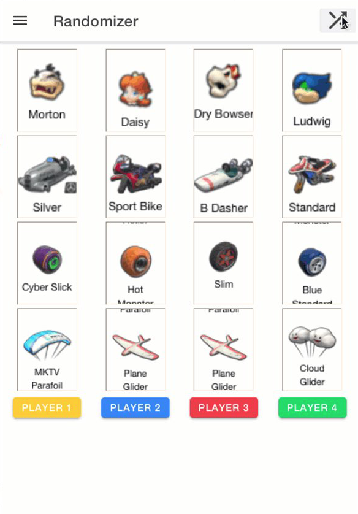

Deploying to app stores is painful. It is hard. There are many aspects of deploying apps that you must get right, and the process differs between the Apple App Store and the Google Play Store. This post describes my experience with that process, and why I became so captivated with Progressive Web Applications (PWAs). 

<!--more-->

Note: This is an excerpt from my book, [_Developing Progressive Web Applications with Angular (and Ionic)_](https://amzn.to/2x2fm1v)

# Deploying to the App Store
As I said, it is hard. Here are some of the things you need to do. To build and deploy an app, you need to understand and complete the following steps: 
- You need to have the proper Developer Account. Apple charges $99/year for an individual. Google is a much more reasonable $25 one time. 
- You must understand, create, and install device profiles for the devices you intend to support. 
- You must create and install the proper Signing certificates. These are used to encode your app cryptographically and prove that you are the one who created it. 
- You need to decide what devices you intend to support.  
- Of course, you need to design, code, and build your app. 
- Then you must sign your app with the signing certificates created earlier. 
- Next, you bundle the app, and upload it to each store. 

If you think you are done at this point, you are not. Before you can make your app available to the public, there are other assets you need to provide: 
- You will need to supply marketing videos and screenshots of the application at various resolutions for a variety of device types and sizes. 
- You need to create icons at multiple resolutions. 
- You will have to complete a questionnaire to determine the right age rating. 
- You need to set a price. Note that if you set your app to Free on Google Play, you can never charge for it.  
- You must create and supply a Privacy Policy. 

Once you have done all this, only then can you submit your app for review. And then you wait. In the past, this process could take weeks. Though it has gotten faster, you do not control it. If you did not get everything right above, and sometimes even if you did, you may have your application rejected. 

That is what happened to me. Both Apple and Google rejected my application outright, and was the final straw motivating me to release my app as a PWA.  

# The Offending Application 
What was this horrific application, you ask? It all starts with Mario Kart 8 for the Nintendo Wii U. 
 
 
My family loves playing Mario Kart. No, I did not create a Mario Kart 8 clone for mobile phones. I created a utility my children and I could use while we play Mario Kart.  

After a few years playing this amazing game, every member of my family had a favorite character, car, wheel, and wing combination. This led to many evenings of predictable outcomes. One night, my youngest child suggested that we randomly select our combinations.  

We started by rolling dice, until one day, another child asked whether I could create an app that does the same thing. I spent the weekend and came up with this: An Ionic-Angular app, complete with 3D animations and sound effects, which could be deployed to either iPhones or Androids. 

Please keep in mind there are other utilities on both stores that assist with playing Mario Kart, so I assumed I would be safe. I was sadly mistaken. My rejection from Apple was swift, (pun intended) and brief. It simply said, “Your app or its metadata appears to contain misleading content. Specifically, your app creates a misleading association with Mario Kart.” My home page clearly indicates that I am not affiliated with Nintendo in any way.  

Google’s rejection was even shorter: “Your application has been suspended.” 

I appealed both rejections, explaining why I thought it should be allowed. Apple disagreed. Google never responded. 
It was then I discovered how easy it would be to turn the application into a PWA and let others experience the joy thus far denied to them. 

# Mario Kart 8 Randomizer 
The result was a progressive web application I call Mario Kart 8 Randomizer, or MK8R. It is built with Angular and the Ionic Framework. Converting it to a PWA took very little effort, as most of the work was done by the @angular/pwa package I wholeheartedly recommend that approach to anyone wanting to deploy their own PWAs.

It can be run directly from its web site. And like all other PWAs:

- It can be installed directly onto your mobile device.
- It includes a custom icon and splash screen.
- It can run 100% offline

You can experience and install the application from here: http://mk8r-pwa-final.web.app

The source code is open and available on [GitHub](https://github.com/walkingriver/mk8r-pwa). 

# The Book
Once I had been through the process of turning an Angular/Ionic app into a PWA, I decided to share those lessons with the world. So I put them in a book, [_Developing Progressive Web Applications with Angular (and Ionic)_](https://amzn.to/2x2fm1v), now available at [Amazon.com](https://amzn.to/2x2fm1v).

_Note: These are affiliate links to Amazon.com, and I could potentially receive a commission for any sales resulting from them._
